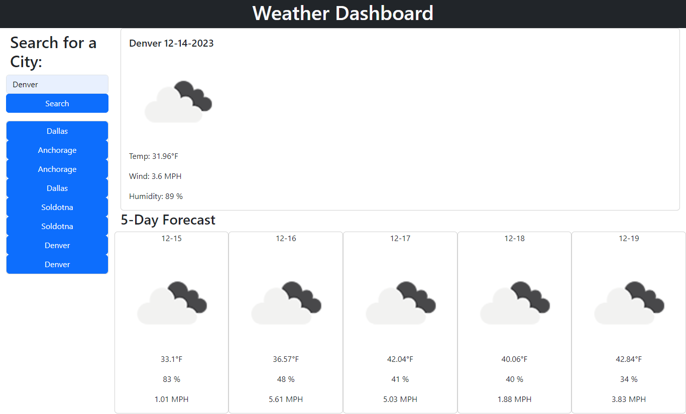

# Server-Side APIs Weather App Assignment   

## Description
The purpose of this assignment was to use my knowledge of server-side APIs, JavaScript, and HTML to create a Weather Dashboard site. This website displays information using dynamically created elements from JS. I employed the use of API calls to the OpenWeatherMap API to retrieve forcast data for cities that are searched using the bar on the left-hand side of the page. In my JS file I used information retrieved from one API call to perform another API call for weather information. Once all the forecast information was gathered, I used for loops to iterate through data retrieved in API calls and display selected information to the Dashboard site.

## Technology Used
The technology used in this challenge consists of the Bootstrap CSS framework for styling, and the OpenWeatherMap API.

## Screenshot

## Link
[Link to Webpage](https://sailorshy94.github.io/ssAPIs-weatherapp-assignment/)